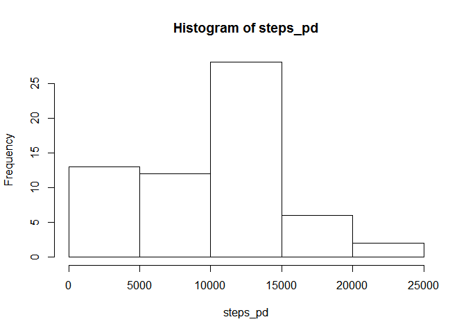
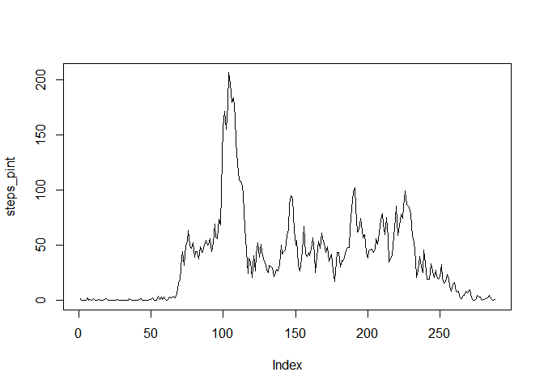
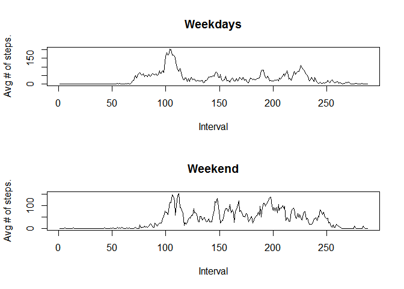

# Reproducible Research: Peer Assessment 1


## Loading and preprocessing the data

For preprocessing purposes, the data is read into the variable `steps` and a factor is created
for the date.


```r
library(lubridate)
#preprocessing
steps<-read.csv("activity.csv")
steps$date<-ymd(steps$date)
steps$date<-factor(steps$date)
```


## What is mean total number of steps taken per day?
The histogram below illustrate the number of steps per day.


```r
steps_pd<-tapply(steps$steps, steps$date, sum, na.rm=TRUE)
hist(steps_pd)
```

 

On average, 9354.23 steps are taken per day with a median of 10395.

## What is the average daily activity pattern?
1.  The graph below plot the average number of steps per interval.


```r
steps_pint<-tapply(steps$steps, steps$interval, mean, na.rm=TRUE)
plot(steps_pint, type="l")
```

 

2. The interval with the maximum number of steps on average are:


```r
which.max(steps_pint)
```

```
## 835 
## 104
```


## Imputing missing values
1. Number of missing values.

The strategy followed to replace missing data is to use the median for the interval as replacment value.Missing values are calculated as below:


```r
for(i in levels(steps$interval)) { 
  d<-steps[steps$interval==i,]
  m<-median(d$steps, na.rm=TRUE)
  d$steps[is.na(d$steps)] = m
  steps[is.na(steps$steps) & steps$interval==i,]$steps<-m
}

## For some reason, knitr did not execute the for loop, above.  I had to save this
## information in an external table and read it in again to work:
steps<-read.table("fixed_data")
## Refer to fixit.R for the code to generate the data, it is exaclty the same
## as the code above. 
```


After executing the above lines, the number of NA values are 0.

The figure below show the updated histogram after replacing all NA values.


```r
steps_pd<-tapply(steps$steps, steps$date, sum, na.rm=TRUE)
hist(steps_pd)
```

 

On average, 9503.87 steps are taken per day with a median of 10395.

## Are there differences in activity patterns between weekdays and weekends?

The first step is to encrich the data to determine if each day fall within the weekend or not:


```r
steps$weekday<-ifelse(weekdays(as.POSIXct(steps$date)) %in% c("Saturday", "Sunday"), "weekend", "weekday")
steps$weekday<-factor(steps$weekday)
```

The next is to extract the information into a new dataframe for graphing:


```r
steps$interval=factor(steps$interval)
weekdays<-steps[steps$weekday=='weekday',]
weekend<-steps[steps$weekday=='weekend',]
dd<-data.frame(interval=levels(steps$interval))
dd$weekdays<-tapply(weekdays$steps, weekdays$interval, mean)
dd$weekend<-tapply(weekend$steps, weekend$interval, mean)
```

And finally, the plot itself:


```r
par(mfrow=c(2,1))
plot(dd$weekdays, type="l", xlab="Interval", ylab="Avg # of steps.")
title("Weekdays")
plot(dd$weekend, type="l",xlab="Interval", ylab="Avg # of steps." )
title("Weekend")
```

 
